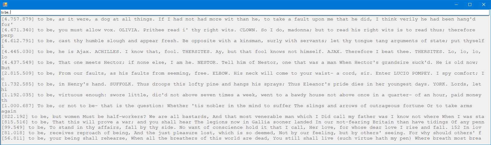

# Searching Shakespeare  
This is my solution for [this assignment](https://datsoftlyngby.github.io/soft2020spring/resources/31a4d1c0-03-miniproject-searching-shakespeare.pdf).  
The program runs only on **Windows**. It takes around 46 seconds to build the suffix tree.  
When searching for "to be, " these are the results:  
  
The number on the left is the position in the shakespeare text file on the first letter in the suffix.  

I am aware code still needs some refactoring for readability :)